# shell
## shell -> 内核
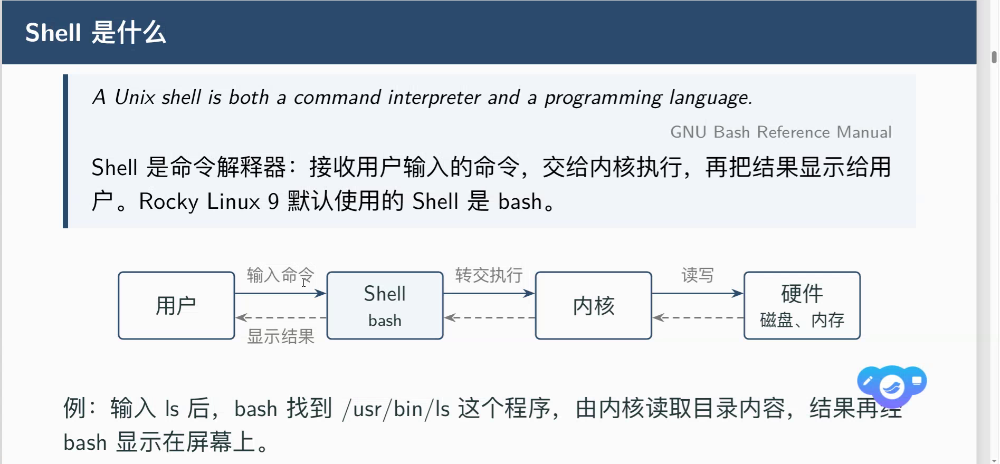

# 命令三段式
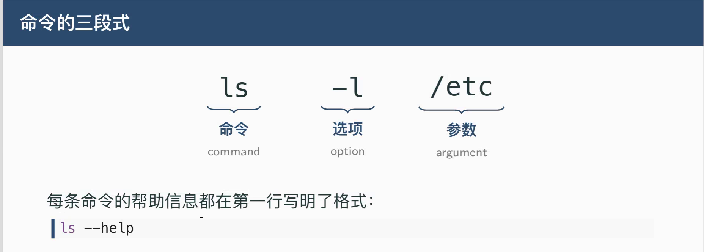
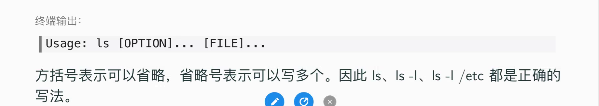
## ls -l(-long)
## ls -a(-all)
## ls -l \
## ls --help
## ls --help | head -20(查看头部前20行)

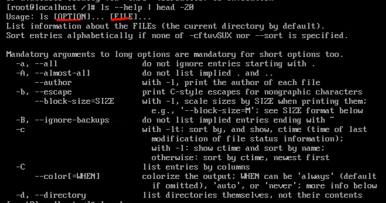
## ls -la
## 选项用[]括起来表示可以选可以不选

# 选项
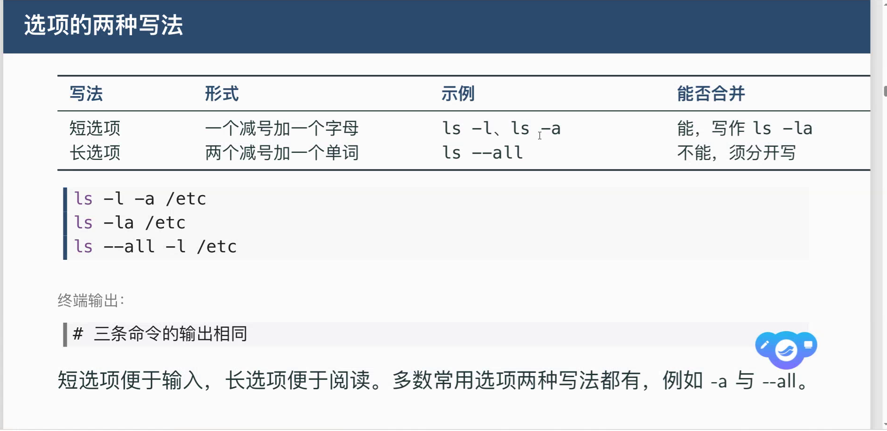

# 练习
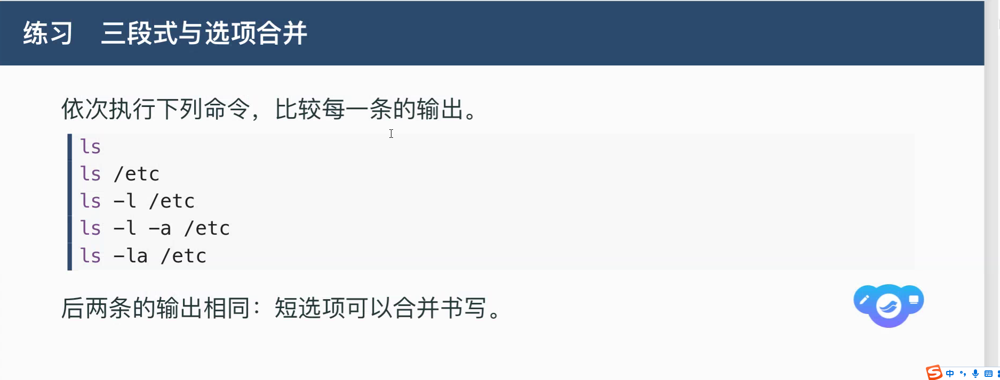
## cd /
## ls
## ls -l /etc | head -20
## ls -l -a /etc | head -20
## ls -la /etc | head -20
## ls -a /etc
## ls -ld /etc:-d：如果参数是目录，只显示这个目录本身的信息，而不是列出目录里面的内容,用来查看目录本身的详细属性，而不是查看目录里的内容

# man(manual,查看联机手册)
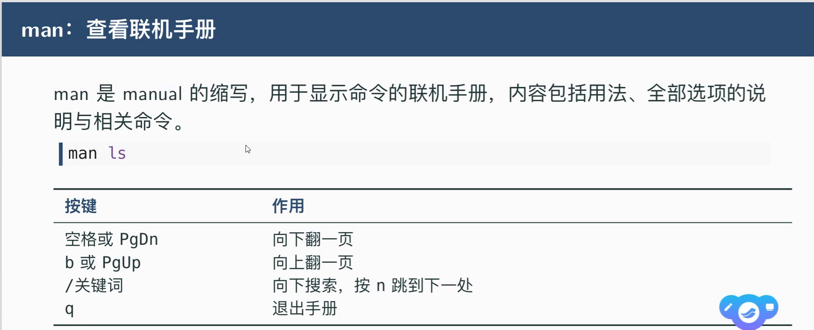

## man ls
## /size:搜索、n:调到下一处
## man的分节
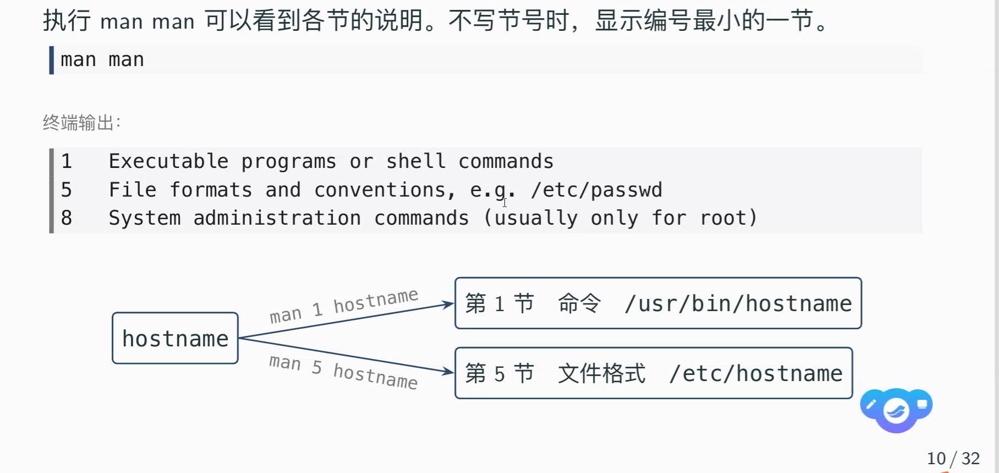
## man 1 passwd
## man 5 passwd
## dnf install man

# clear(清空命令)

# 练习
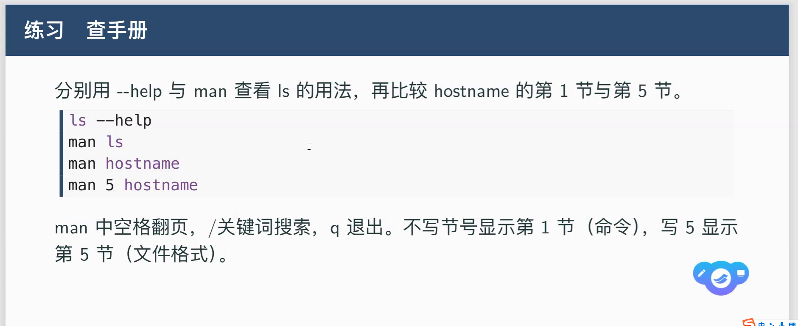

# Linux没有盘符
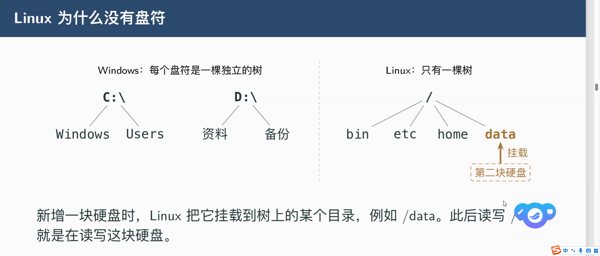
## 目录树
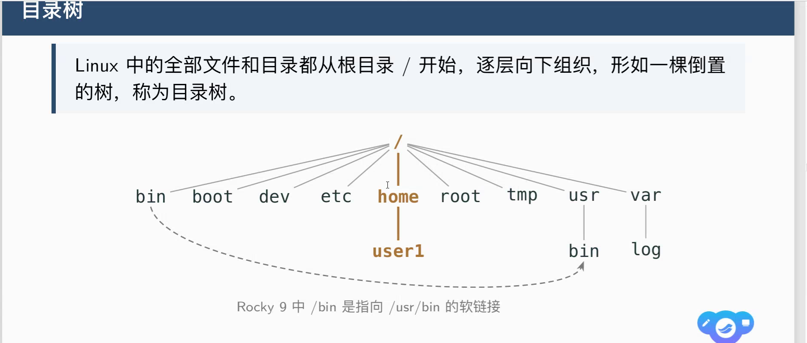
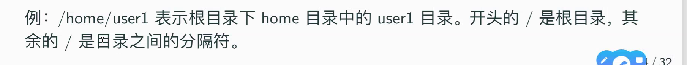
## 目录作用
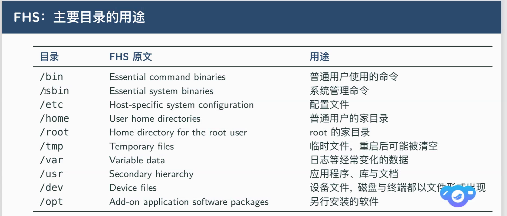
## 家目录
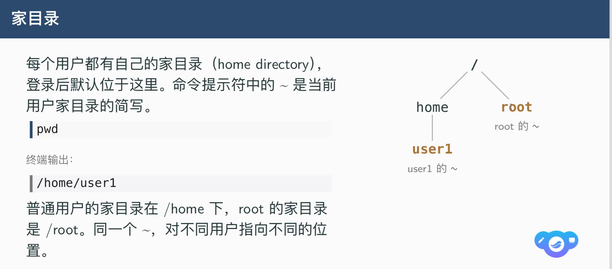

# 路径
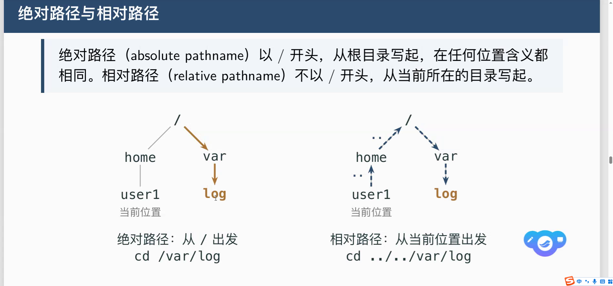
## 相对路径(从当前路径出发)
### . :当前路径
### .. :退回上一级路径
### cd ../../
## 绝对路径(从/出发)

# 四种符号
## .:当前目录
## ..:上一级目录
## ~:回到当前用户的家目录
## -:上一次所在的目录(有权限限制)
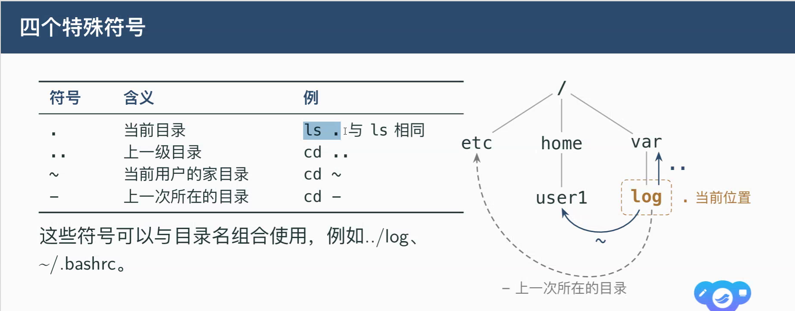

# 练习
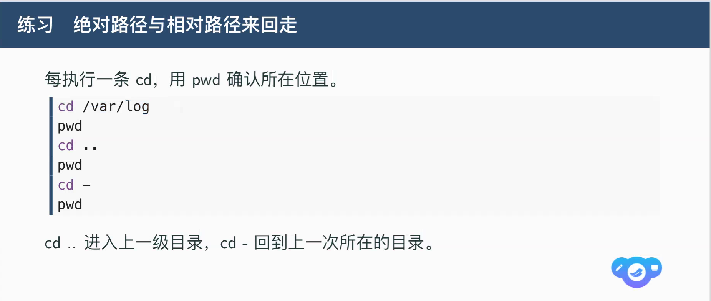

# 导航命令
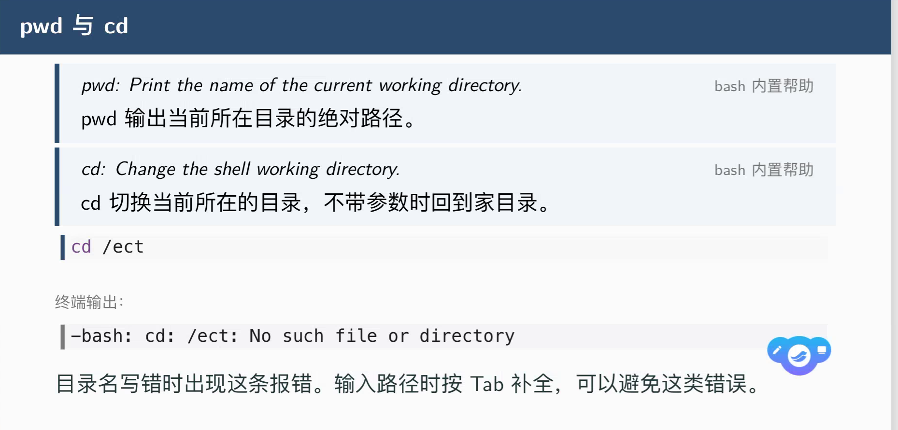
## pwd
## cd
## ls
### ls -l的一行输出
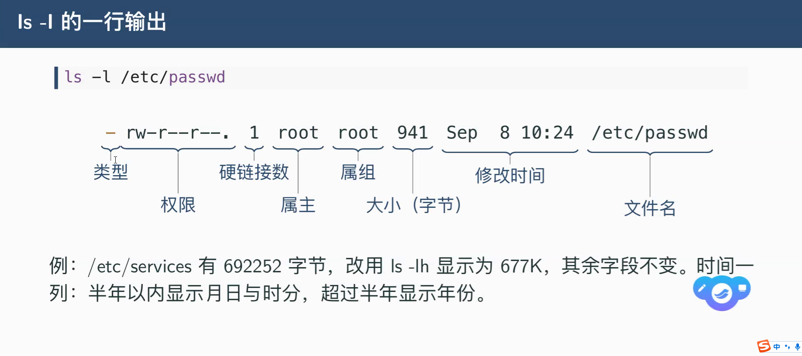
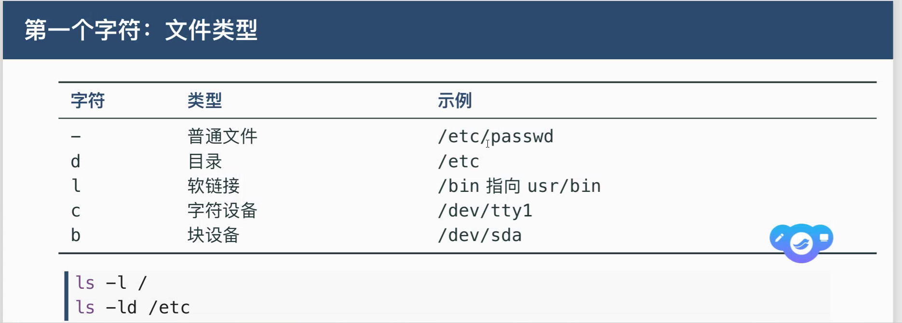

# 练习
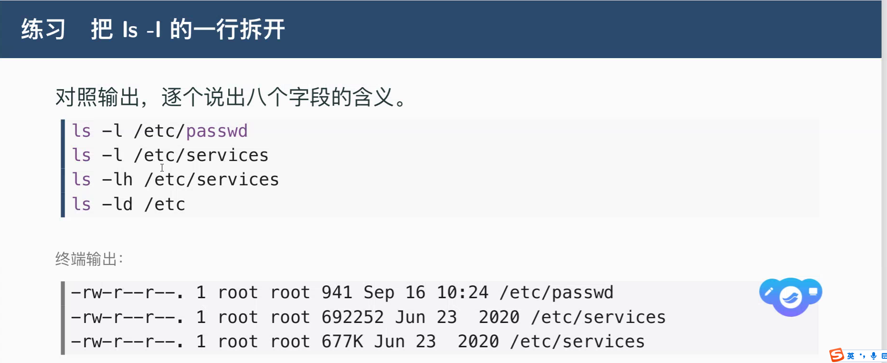
## ls -lh /etc/services!

# 隐藏文件
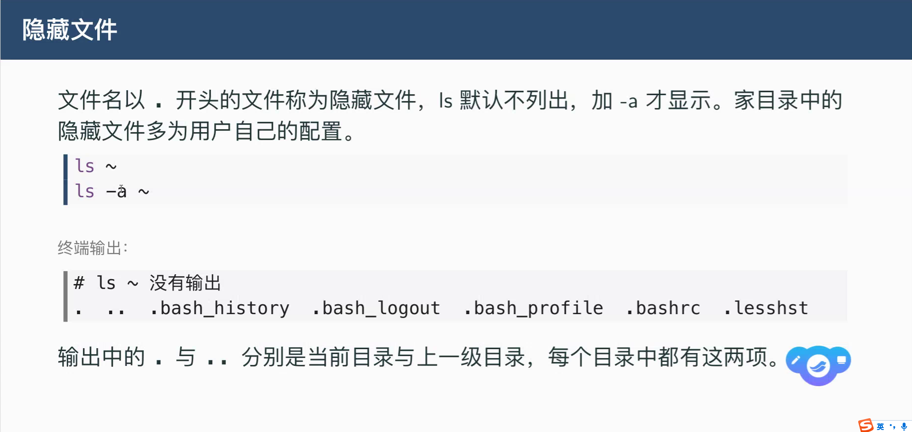

# file
## 查看文件路径的类型

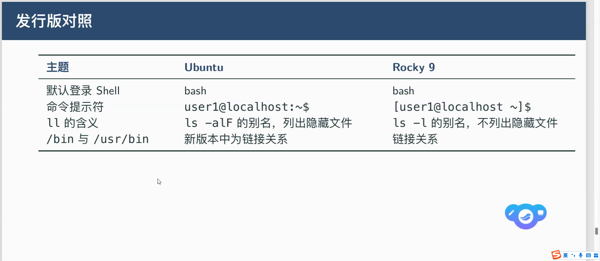

# ssh root@192.168.153.128
# scp
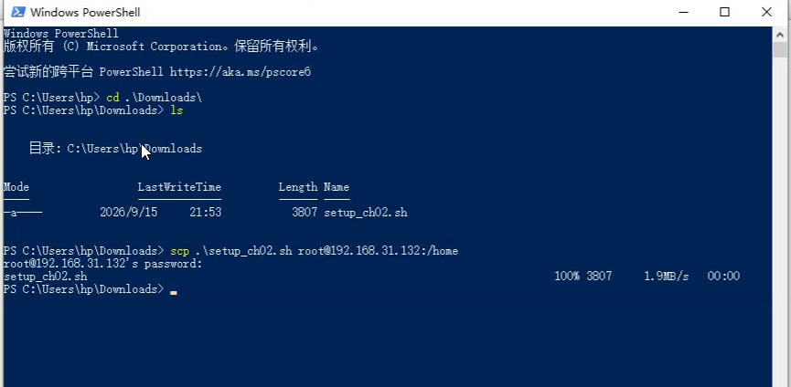
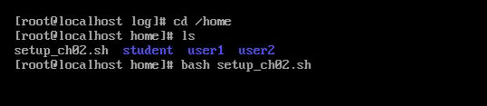
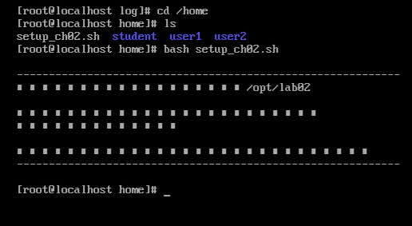