# 文件与目录
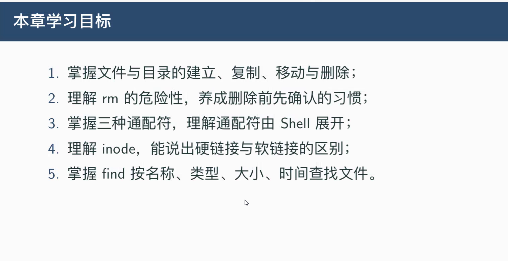

# touch :创建空文件
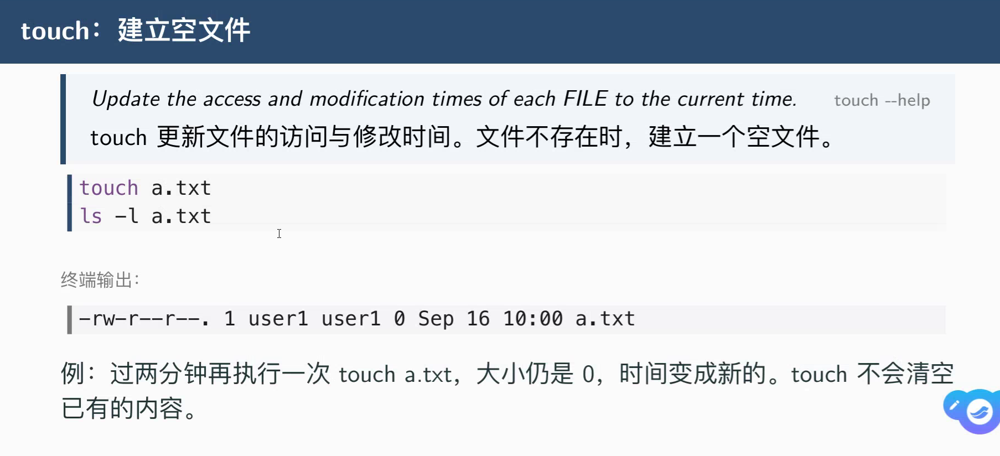
## touch -t :设置指定时间
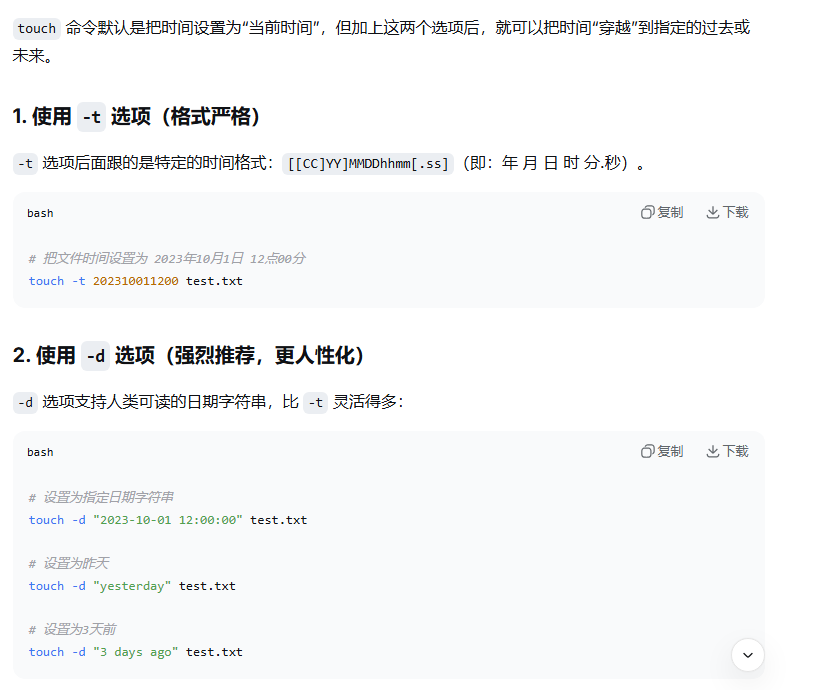

# mkdir :创建目录
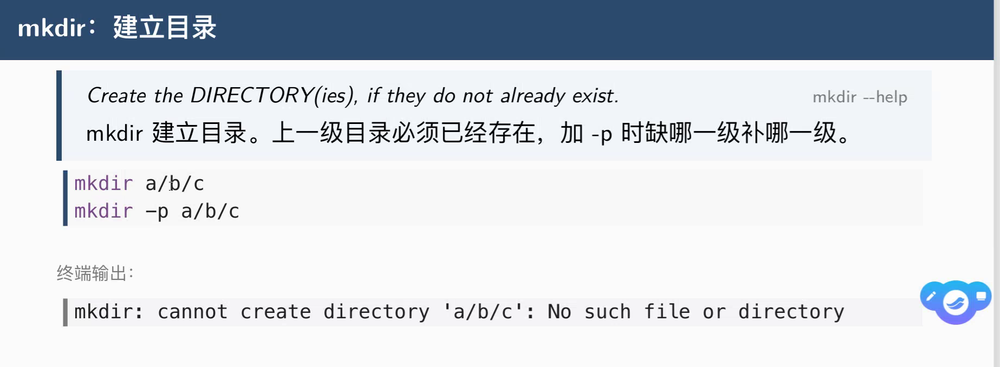
## mkdir -p 
## 不能直接连跳两级创建目录,加了-p 参数可以直接连跳两级创建目录

## 一次创建多个目录
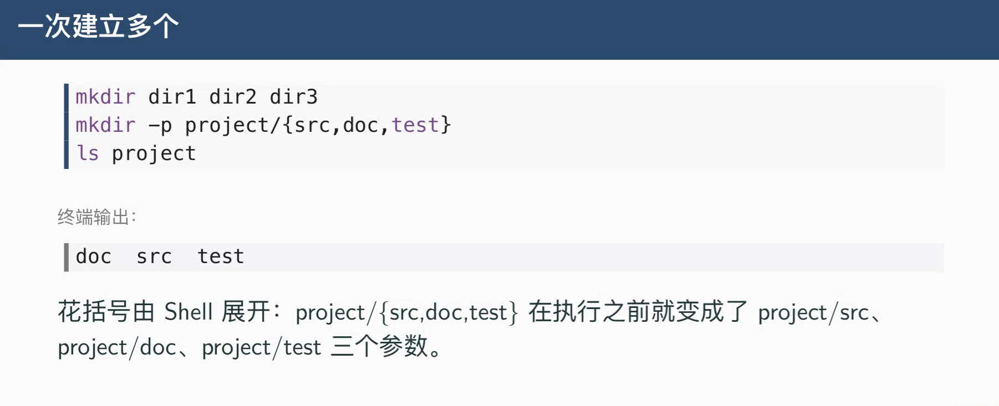

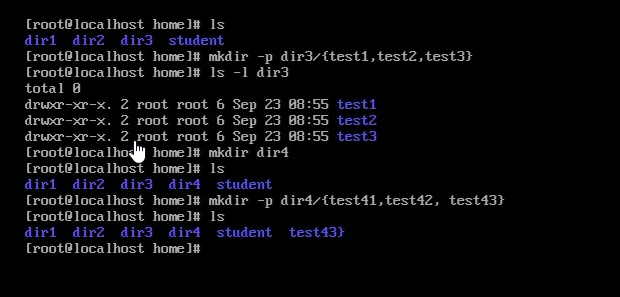
### mkdir 目录1 目录2 目录3
### mkdir -p 目录/{文件1,文件2,文件3}

# 练习
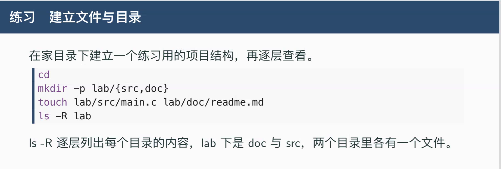
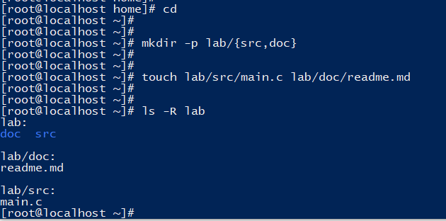

# cp :要加 -r 
## cp -r
## cp -i
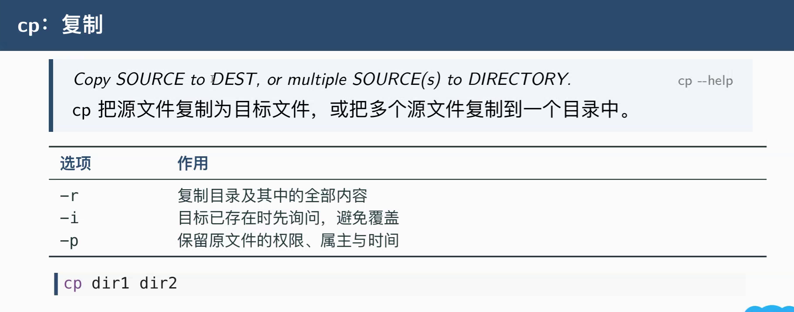
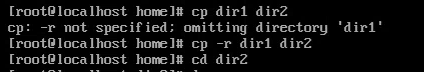

# mv
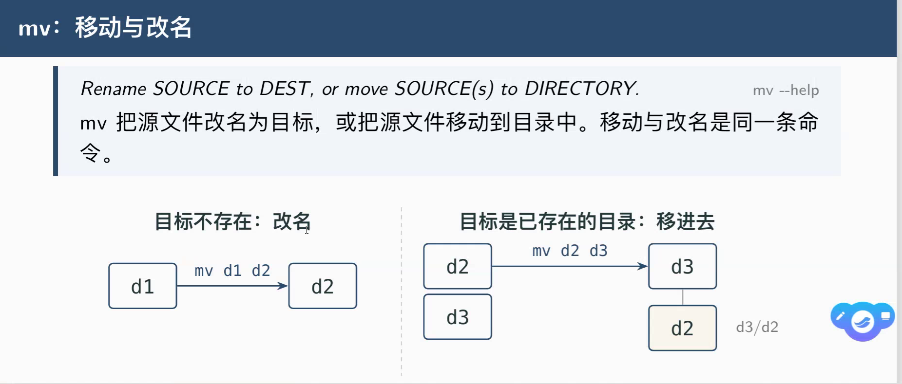

## mv 文件1 文件2 :把文件1移动到文件2,还是使用文件2的名字

# rm、rmdir
## rmdir :只能删除空目录
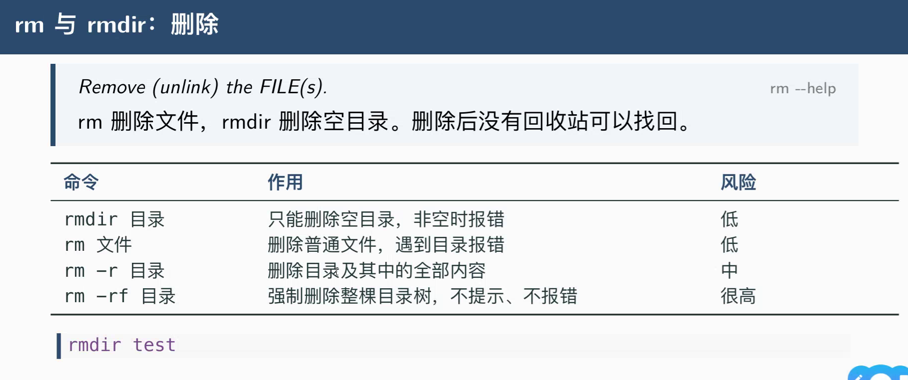

## rm -rf
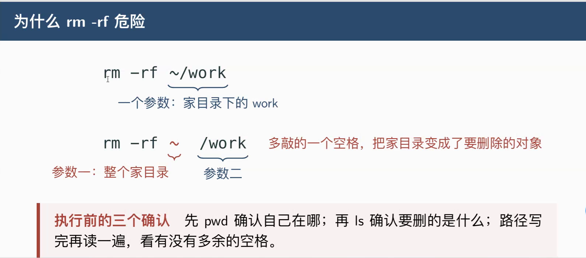
## rm -i

## rm -rv :(verbose):详细模式

# cp与mv
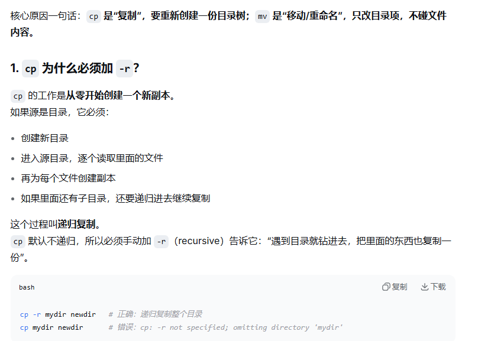

# 练习
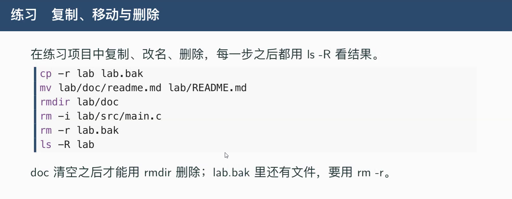

# 通配符
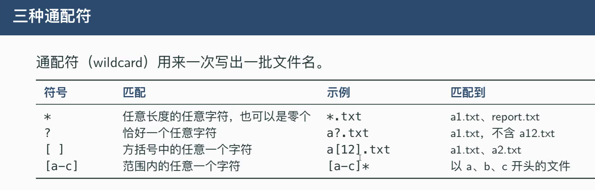
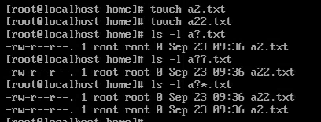
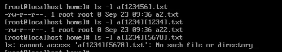
## echo :打印
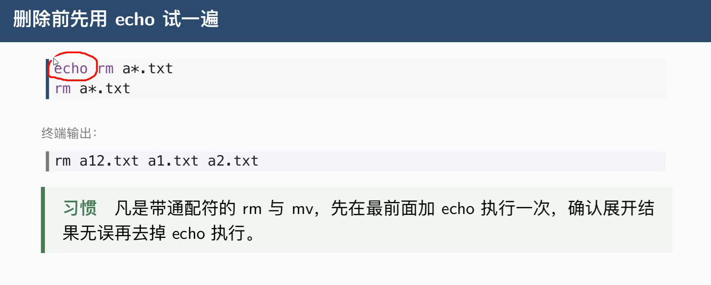

# 练习
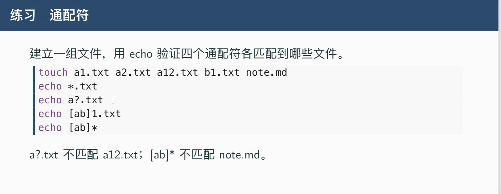
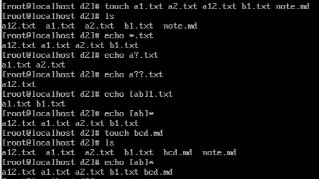

# inode
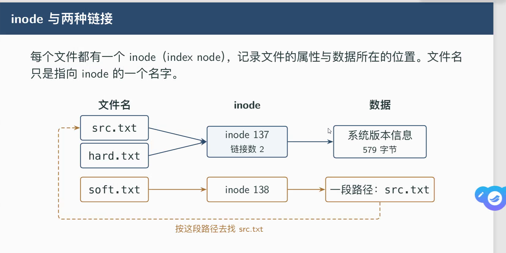
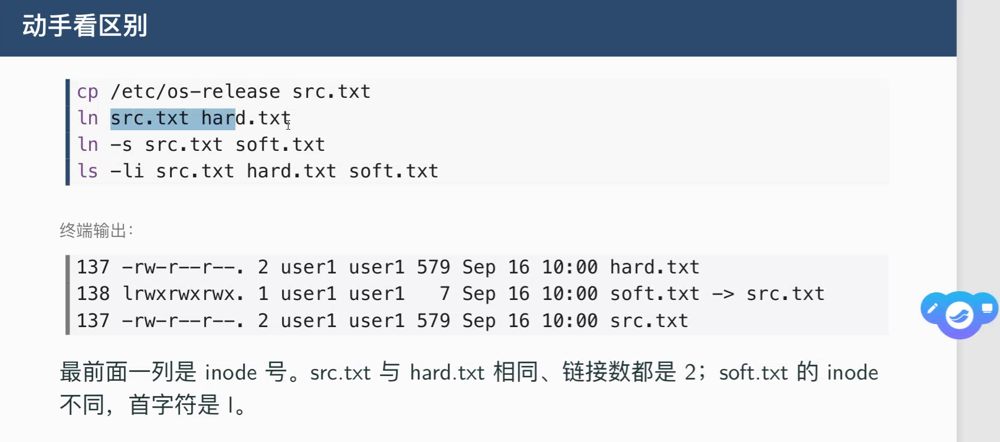
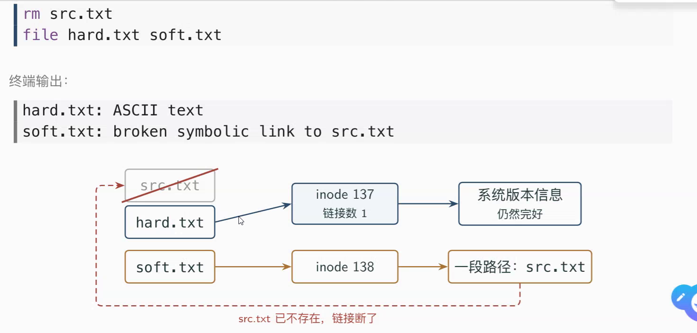

# find
## find -name
## find -type
## find -size
## find -mtime
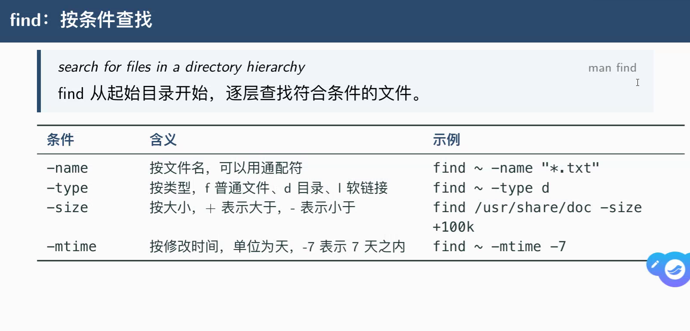
## 多个条件一起用
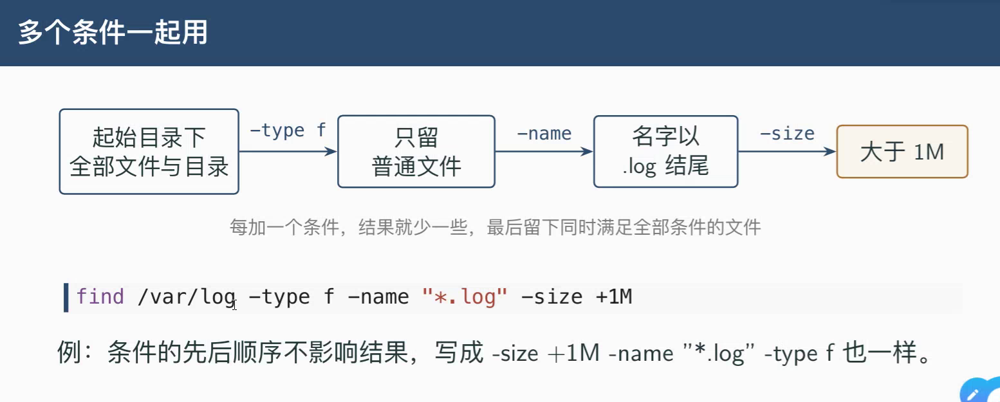
## find -empty :找出空目录和文件

# 练习

# ln(link):为文件或目录创建链接
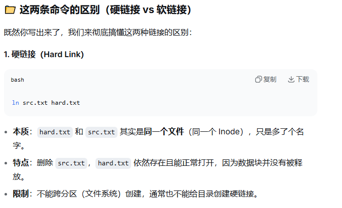
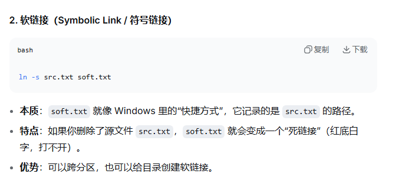
# ln 文件1 文件2 :硬链接
# ln -s 文件1 文件2 :软链接
## -s(Symbolic Link)

# ls -li :查看inode编号