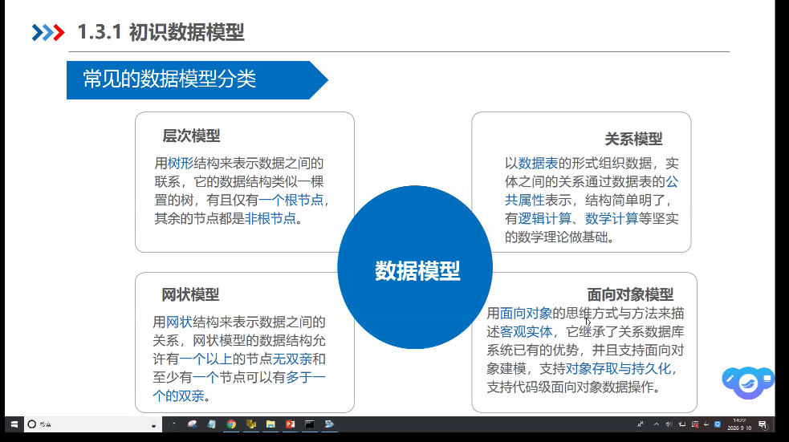
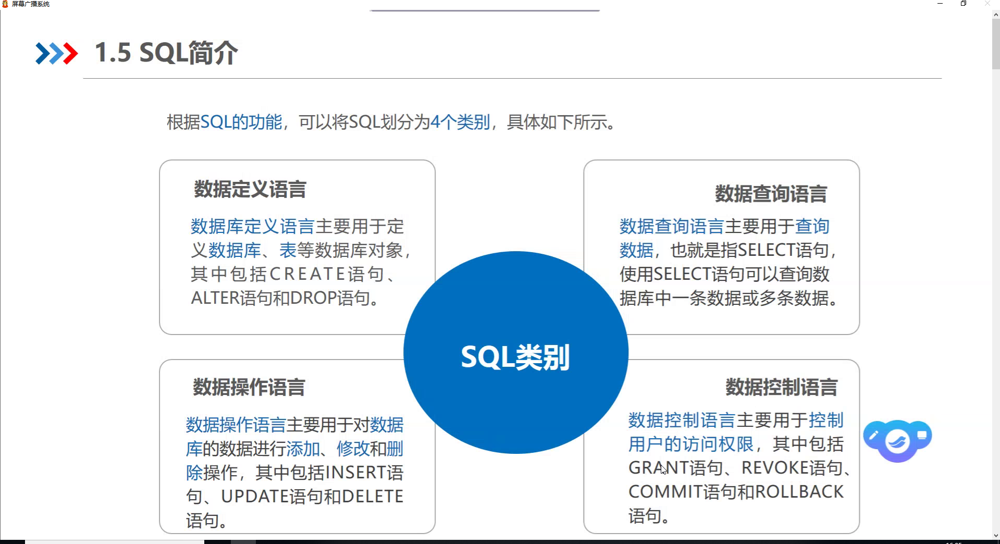
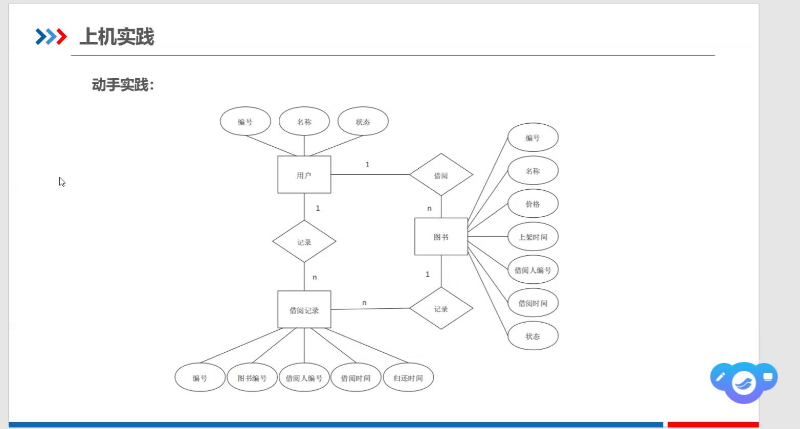
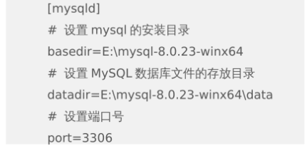

# 课堂笔记

#  
# 
# 
# 
# 
# 

# 
# 数据库、数据库管理系统、数据库系统
# 数据库(Darabase,DB):对数据的存储
# 数据库管理系统(Database Management System,DBMS):对数据的组织、存取、管理、维护
# 数据库系统(Database System,DBS)

# 数据模型:1、数据结构、数据操作、数据约束
# 2、按数据结构分为层次模型、网状模型、关系模型面向对象模型
## 层次模型:树形结构,一个根节点
## 网状模型:网状结构一个以上的节点无双亲,至少有一个节点有多于一个的双亲
## 关系模型:数据表、实体、属性
## 面对对象模型:面对对象、客观实体、对象存取与持久化

# 数据模型:实体、属性、联系、实体型、实体集
## 实体:客观存在并可相互区分的事物
## 属性:实体所具有的某一特性,一个实体可由若干个属性来描述
## 联系:实体与实体之间,一对一、一对多、多对多
## 实体型:实体名(如学生)及其属性名集合(如学号、学生姓名、性别)来描述同类实体
## 实体集:同一类型的实体集合,如全校学生

# E-R图:实体-联系图,用图形表示的实体联系模型
# 实体:矩形
# 属性:椭圆框
# 联系:菱形框,连接实体,联系类型:一对一(1:1)、一对多(1:n)、多对多(m:n)

# 
# 关系模型:关系、属性、元组、域、关系模式、键
# 属性:二维表中的列,每个属性都有一个属性名
# 元组:二维表中的每一行数据称为一个元组
# 域:属性的取值范围
# 键:唯一标识某一条记录,又称为关键字、码

# 完整性约束:保证数据库中的数据的正确性和相容性,对关系模型进行完整性约束。包括域完整性、实体完整性、参照完整性、用户自定义完整性
## 域完整性:取值的合理性
## 实体完整性:关系中的主键不能重复,不能取空值
## 参照完整性:要求关系中的外键要么取空值,要么取元组的主键值
## 自定义完整性:用户针对具体的应用环境定义的约束条件

# 键值存储数据库
# 列存储数据库
# 面向文档数据库
# 图形数据库

# SQL(Structured Query Language):结构化查询语言,关系型数据库语言的标准

# Mysql的默认端口是`3306`

# 图形化管理工具:SLyog、Navicat

Navicat

# MySql

<!-- 安装Mysql的步骤 -->
# 配置文件:my.ini    
# 
# 执行初始化:mysqld --initialize --console (注意是mysld,执行完之后注意并记住密码root@~~)
# 安装Mysql服务:mysqld --install
# 启动Windows后台的MySql服务:net start mysql;停止服务:net stop mysql
# 登录:mysql -u root -p ~（输入的-uroot可以连在一起,中间也可以有空格;-p和密码之间要有空格隔开）
# 也可以修改密码:ALTER USER 'root'@'localhost' IDENTIFIED BY '你的新密码';
# 配置环境变量的命令:setx PATH "%PATH%;D:\mysql-8.0.23-winx64\bin"
## setx PATH "%PATH%;D:\mysql-8.0.23-winx64\bin" /M (/M 表示修改系统环境变量)
# 退出Mysql的命令:exit;

# 三大对象，四个操作
# 对数据库增、删、改、查
# 数据是以表的形式存放;数据库里面的是数据表,数据表里面的是数据

# 命令(mysql>):1、show databases; (查看数据库的命令)
#              2、use mysql (用数据库里面的)
#                 show tables; (查看数据表)
#               3、select * from user
#               4、mysql -h localhost -u root -p(登录Mysql的命令,localhost可以改为另一台电脑/虚拟机的ip用来远程连接)
#               5、ALTER USER 'root'@'localhost' IDENTIFIED BY '123456';(修改mysql数据库中的用户密码)
#               6、客户端:help;服务端:help content
# 注意命令后面要有; 
# 一句命令可以换行写
# 大小写不敏感 
# 关键字要小写 

# 一个数据库最多可以创建多个数据库

# 
# DDL(Data Definition Language):数据定义语言,用于定义和管理数据库、表中的对象(如库、表、视图、索引等),常见指令:create、alter、drop
# DML(Data Manipulation Language):数据操纵语言,用于对数据库表中的数据进行操纵,insert、update、delete
# DQL(Data Query Language):数据查询语言,主要用于查询数据库中的数据,最常见的指令:select
# DCL(Data Control Language)数据控制语言,用于控制数据库的访问权限和事务管理,常见指令:grant、revoke、commit、rollback

# DOS(Disk Operating System):磁盘操作系统,通过键盘敲命令来让电脑运行

# 参照完整性规则要求:不允许引用不存在的实体

# 关系模型的三要素:1、数据结构
#                 2、数据操作
#                 3、完整性约束

# 关系数据库的基本数据结构:二维表

# 表:table
# 画图工具:draw.io

