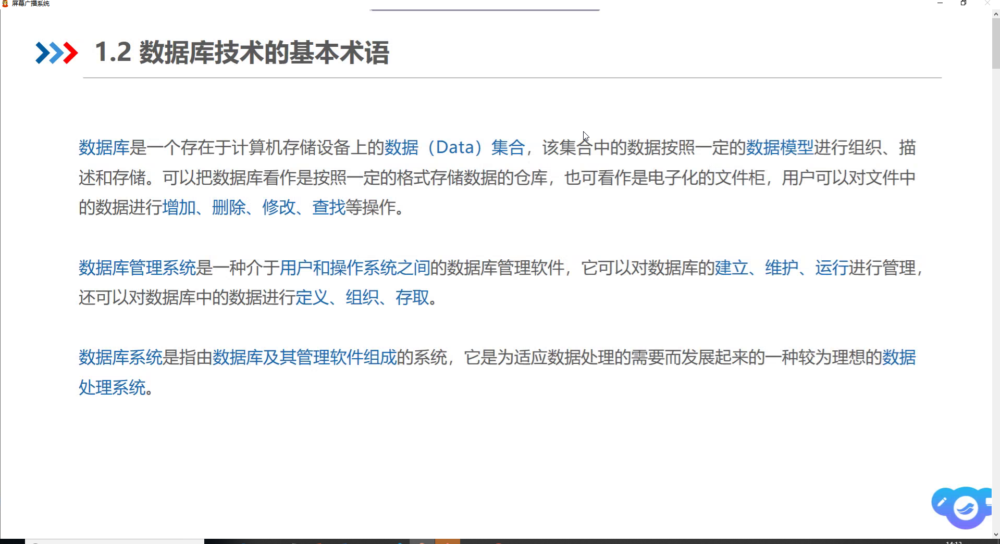
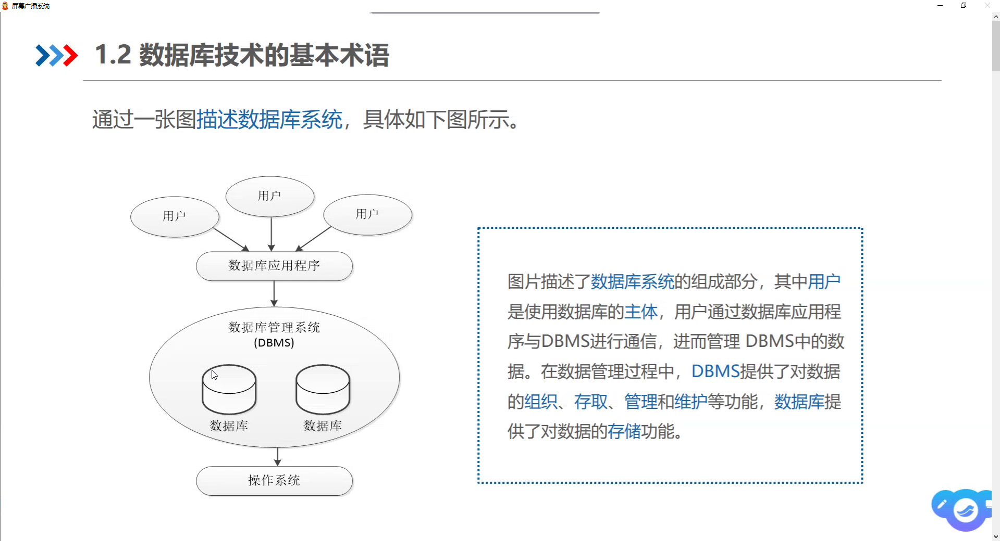

# 课堂笔记

#  
# 
# 

# 数据库、数据库管理系统、数据库系统
# 数据库(Darabase,DB)
# 数据库管理系统(Database Management System,DBMS)
# 数据库系统(Database System,DBS)

# 数据模型:1、数据结构、数据操作、数据约束
#          2、按数据结构分为层次模型、网状模型、关系模型面向对象模型
# E-R图:实体-联系图
# 实体:矩形
# 属性:椭圆框
# 联系:菱形框

# 关系模型:关系、属性、元组、域、关系模式、键
# 属性:列
# 元组:行
# 域:属性的范围

# 域完整性:取值的合理性
# 实体完整性
# 参照完整性
# 自定义完整性

# SQL(Structured Query Language):结构化查询语言

# MySql

<!-- 安装Mysql的步骤 -->
# 配置文件:my.ini
# 执行初始化:mysqld --initialize --console (注意是mysld,执行完之后注意并记住密码root@~~)
# 安装Mysql服务:mysqld --install
# 启动Windows后台的MySql服务:net start mysql
# 登录:mysql -u root -p ~
# 也可以修改密码:ALTER USER 'root'@'localhost' IDENTIFIED BY '你的新密码';
# 配置环境变量的命令:setx PATH "%PATH%;D:\mysql-8.0.23-winx64\bin"
## setx PATH "%PATH%;D:\mysql-8.0.23-winx64\bin" /M (/M 表示修改系统环境变量)
# 退出Mysql的命令:exit;

# 三大对象，四个操作
# 对数据库增、删、改、查
# 数据是以表的形式存放;数据库里面的是数据表,数据表里面的是数据

# 命令(mysql>):1、show databases; (查看数据库的命令)
#              2、use mysql (用数据库里面的)
#                   show tables; (查看数据表)
#               3、select * from user

# 注意命令后面要有; 
# 一句命令可以换行写
# 大小写不敏感 
# 关键字要小写 

# 表:table

