# AD域(Active Directory)

# 工作组模式

# AD域(Active Directory)

# 组织单位:OU(Organization Unit)
# 组(Group)

# 安装活动目录
## 配置ipv4地址时设置域控制器的DNS为自己的(静态)ip或者127.0.0.1,域成员的DNS为域控制器的ip

## 配置ip时要先查看虚拟机的网络编辑器NAT的子网ip配置

## 服务器管理器 -> 仪表盘 -> 添加角色与功能
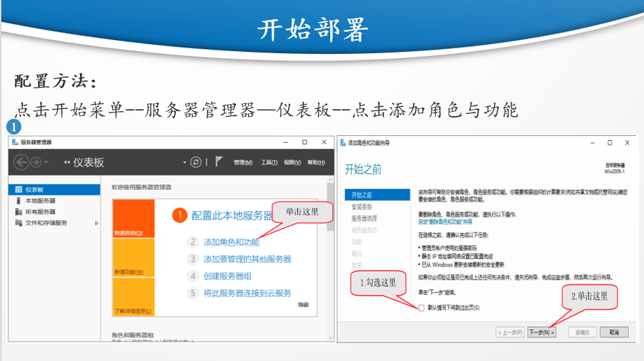
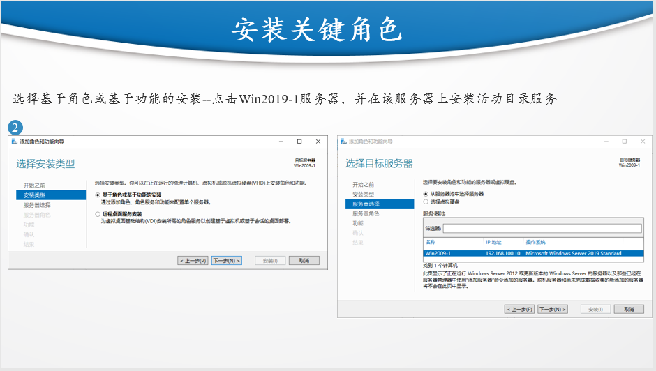
## Active Directory域服务
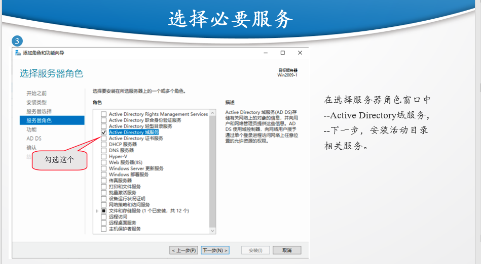
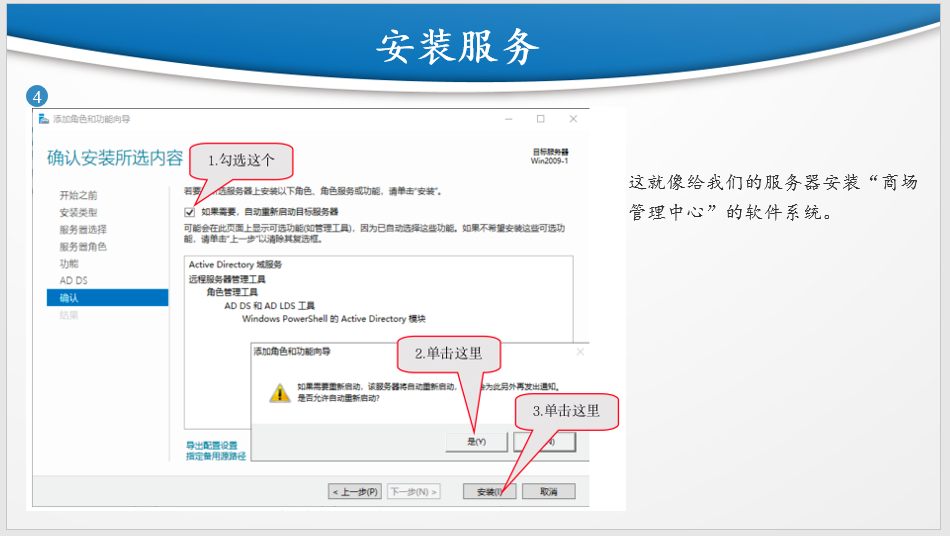
## 黄色三角提醒图标 -> 将此服务器提升为域控制器 
## 添加新林 -> (在域林创建域树再)创建域林的根域abc.com
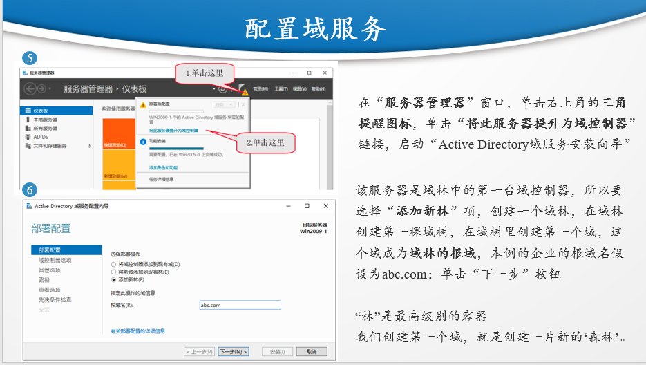

## NetBiOS域名是ABC

## 查看配置:服务器管理器 -> 工具 -> DNS -> DNS管理器

## 配置服务器2时默认网关要和域控制器的一样,DNS要和域控制器的ip地址一样

## 防火墙要放行AD服务的流量

## 配置2属于abc.com域,输入域控制器管理员账号密码

## 查看:服务器管理器 -> 工具 -> Active Directory用户和计算机
## 域账号登录 :域账号@abc.com 或 abc\域账号
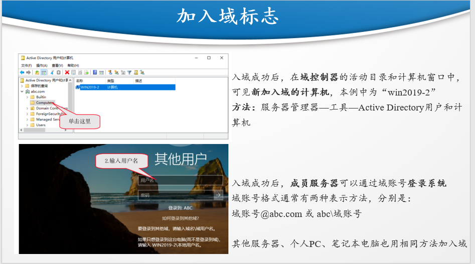
## 新建组织单位 -> 新建用户

## 当将win2019-2加到域控时显示SID相同时可以使用Sysprep来清除系统身份信息

# 域林、域树、域

# AD域管理与应用
## 服务器管理器 -> 工具 -> 组策略管理 -> 域 -> 右键创建GPO
## GPO(Group Policy Object):组策略对象

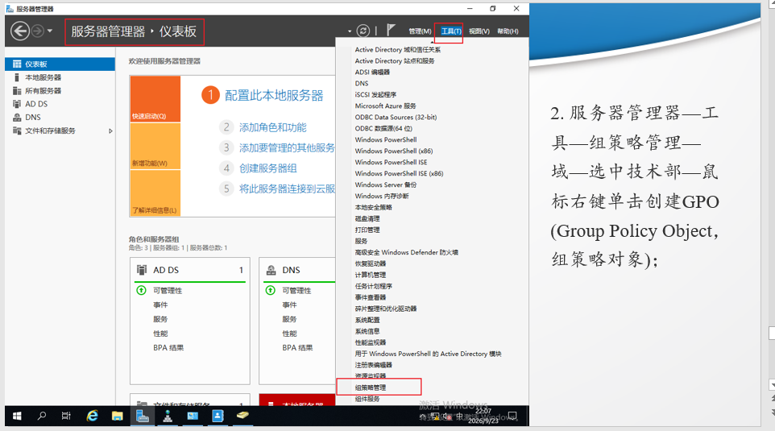
## 选中GPO -> 右键编辑 -> 用户配置 -> 策略 -> 管理模板 -> 系统
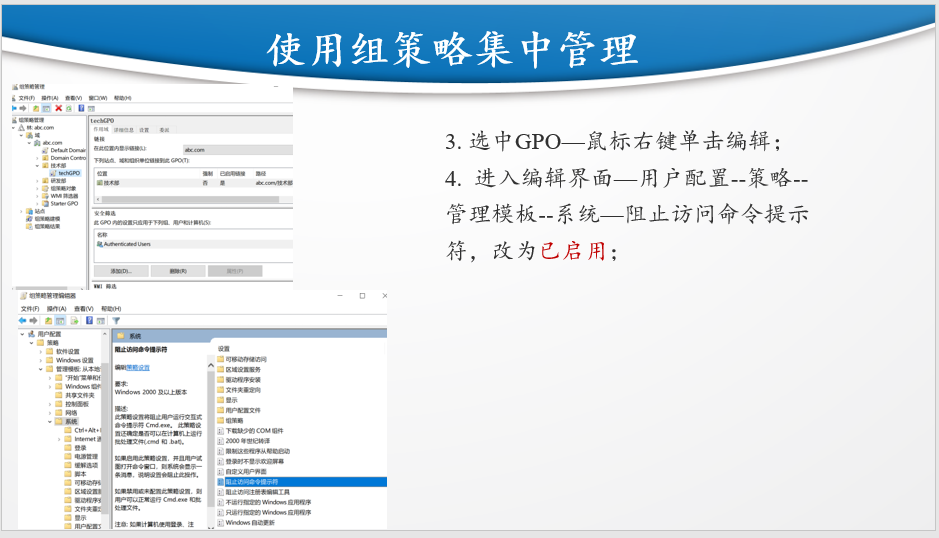
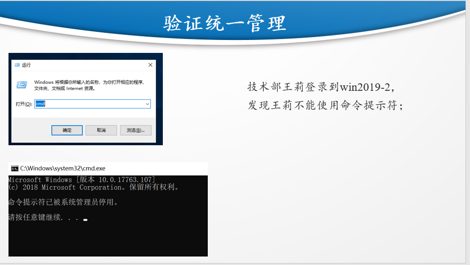
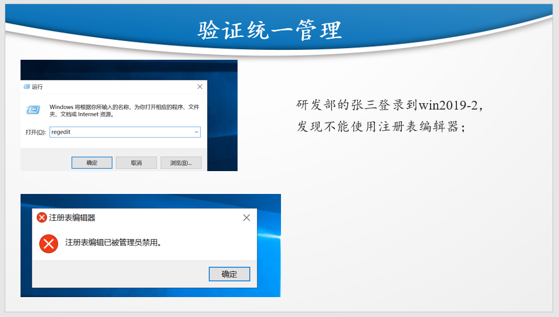

# sysprep(C:/Windows/System32/Sysprep) :清除系统身份信息
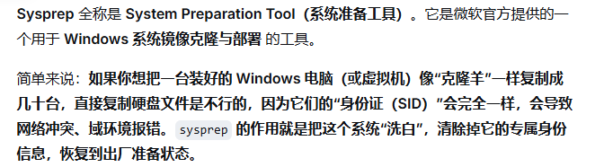

# 服务器管理器 :servermanager(win+R)