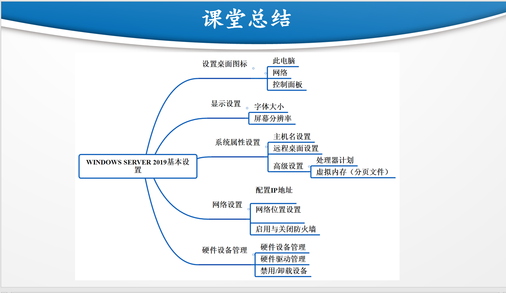
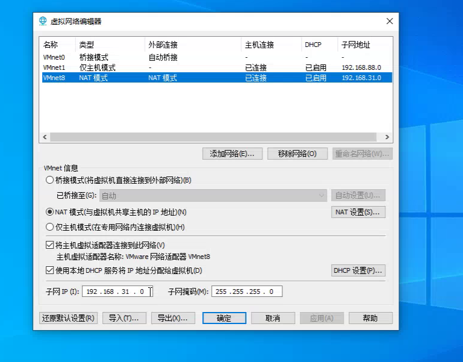

# AD(Activity Directory):活动目录,企业账号和权限集中管理的重要工具

# 操作系统:1、服务器操作系统
#          2、桌面操作系统
#          3、嵌入式操作系统

# 安装Windows Server 2019
# 安装VMware Tools:VMware ToolsVMware Tools是虚拟机的“性能增强套件”和“便利工具包”，用于优化体验与交互。显示分辨率、窗口视频、文件移动、鼠标切换等体验会更好。
# 创建快照(注意:1、非备份方案，大量快照会占用存储并降低性能，应随用随删。2、还原到快照时，该时间点之后的所有数据变更将丢失。)
# 克隆:在克隆机里找到C/Windows/Systerm 32/Sysprep，双击Sysprep.exe，勾选通用
# 图标
# 显示设置
# 修改主机名、修改虚拟机名称
# 远程桌面设置:
## 1、准备工作:打开此电脑—属性—远程设置—允许远程连接到计算机
## 2、mstsc->输入电脑或服务器IP和密码
# 处理器计划:前台程序、后台程序
# 虚拟内存(分页文件)
# 隐藏文件(pagefile.sys)
# 硬件设备管理器

# 

# 设置浏览器(服务器管理器->本地服务器->关闭IE增强)
# 虚拟机网络设置加上DNS(114.114.114.114、8.8.8.8)
##
```
注意，114.114.114.114和8.8.8.8，这两个IP地址都属于公共域名解析服务DNS其中的一部分，而且由于不是用于商业用途的，这两个DNS都很纯净，不用担心因ISP运营商导致的DNS劫持等问题，而且都是免费提供给用户使用的。
2. 114.114.114.114是国内移动、电信和联通用的DNS，手机和电脑端都可以使用，干净无广告，解析成功率相对来说更高，国内用户使用的比较多，而且速度相对快、稳定，是国内用户上网常用的DNS。而8.8.8.8是Google公司提供的DNS，该地址是全球通用的，相对来说，更适合国外以及访问国外网站的用户使用。
```

# 关闭防火墙
# 配置静态IP(虚拟机默认是动态的DHCP)
## 1、桥接模式(Bridge):对应网络编辑器VMnet0
## 2、网络地址转换模式(NAT):对应VMnet8
## 3、仅主机模式(Host-Only):对应VMnet1

## 4、虚拟网络编辑器:点开编辑->虚拟网络编辑器->更改设置->NAT模式->NAT设置->网关(注意不能和自己物理网关一致)
```
IP 地址：决定这台服务器在网络中的地址。
子网掩码：决定网段范围。
默认网关：负责把流量送往其他网络。
DNS 服务器：负责域名解析
```