# 磁盘管理

# 1、分区
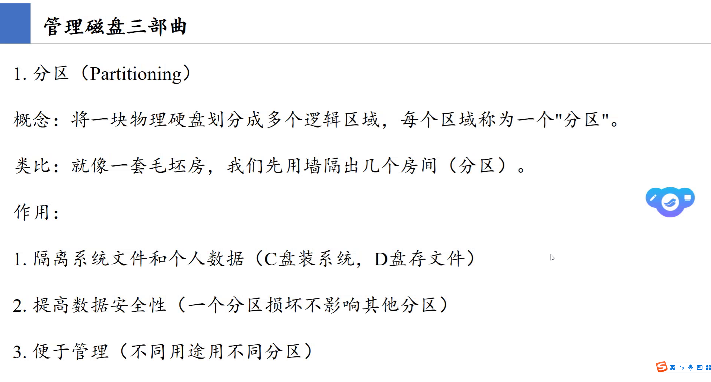

# 2、格式化
## (1)NTFS:Windows默认,支持大文件
## (2)FAT32:单个文件不能超过4GB
## (3)ReFS
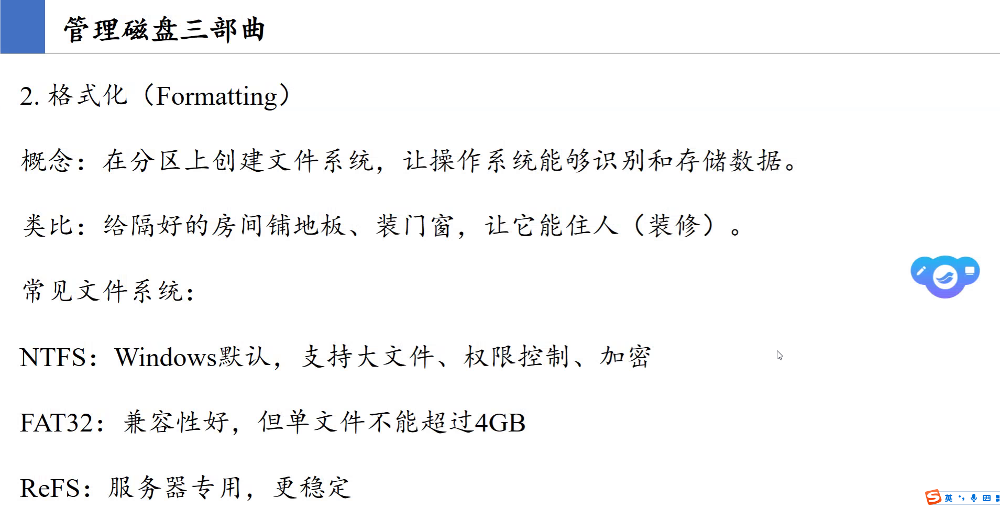

# 3、挂载
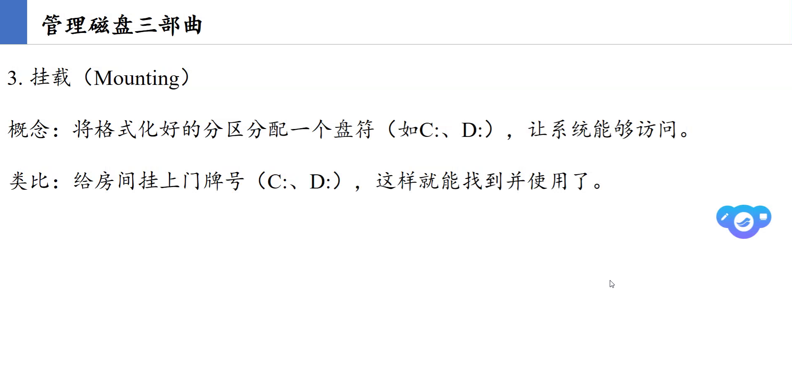

# 4、MBR
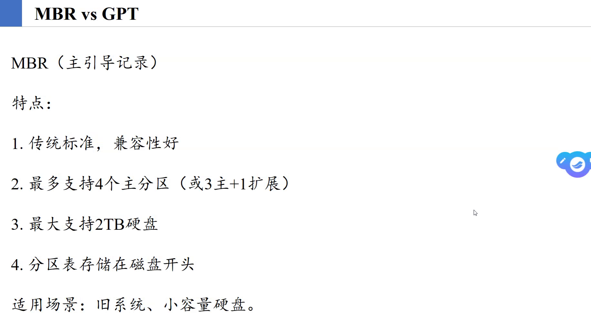

# 5、GPT
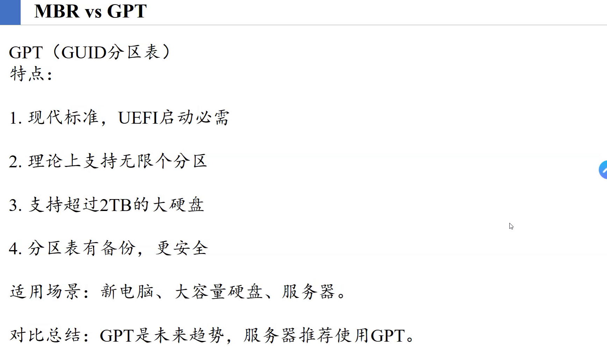

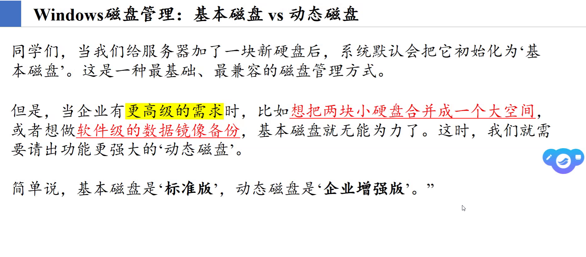

# 6、基本磁盘
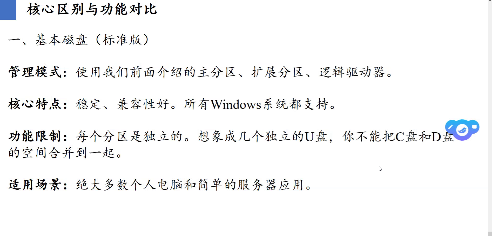

# 7、动态磁盘:卷
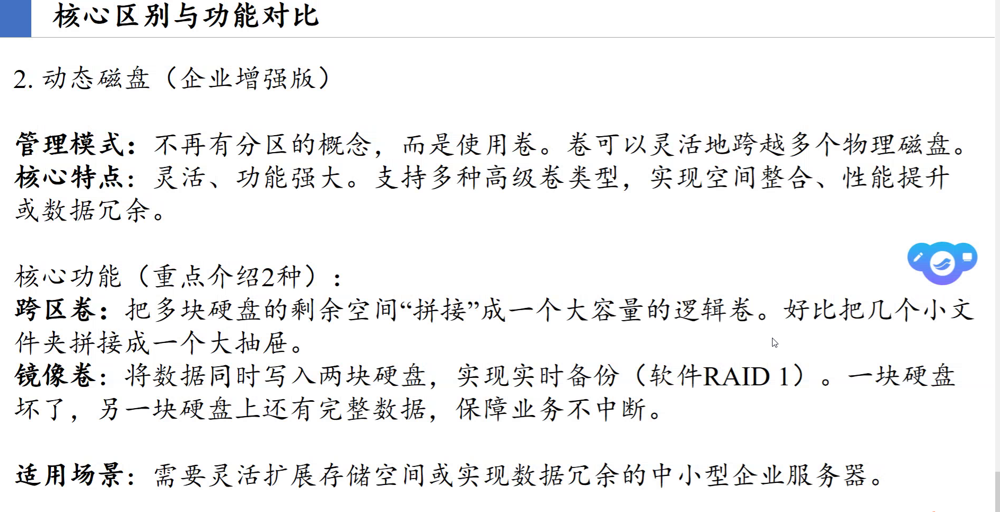
## (1)跨区卷:
### 缺点:没有冗余;抗风险能力差
## (2)镜像卷:
### 缺点:磁盘空间利用率降低一半

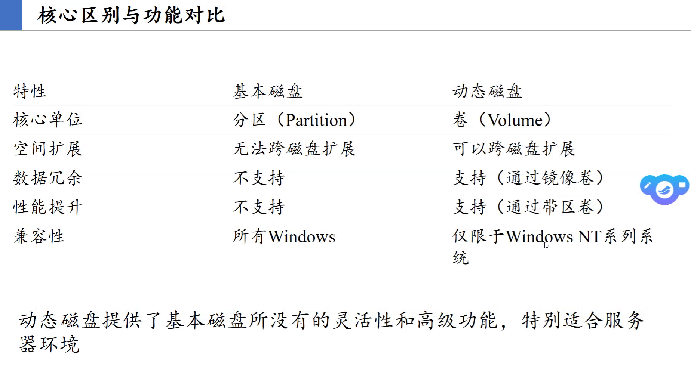
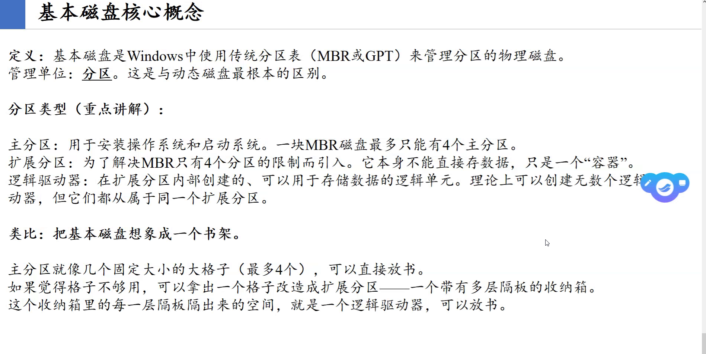
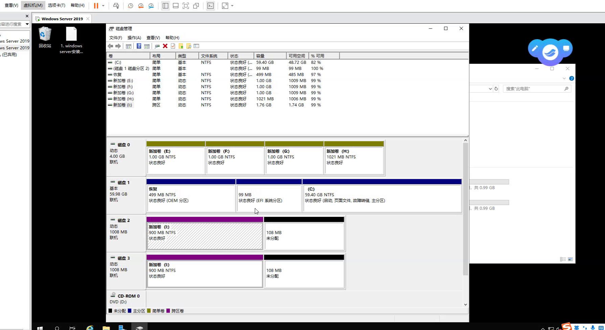
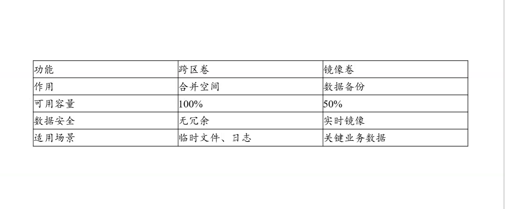

## (3)扩展卷:
### 千万不要随便点“扩展卷”：在基本磁盘上，扩展卷会把目标分区右侧相邻的未分配空间吞掉；如果没有合适的未分配空间，系统为了强行扩展，会将其转换为“动态磁盘”

# 8、RAID:磁盘阵列
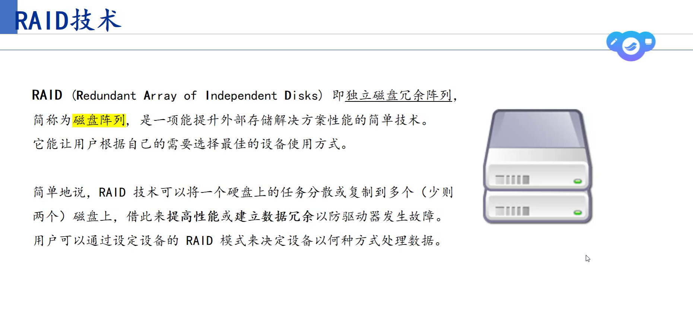

## 术语:
## (1)条带化
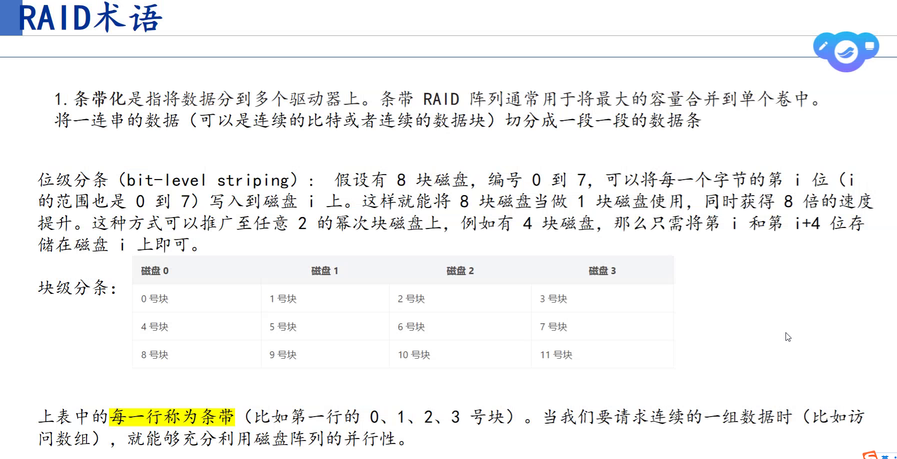

## RAID 0(速度最快)
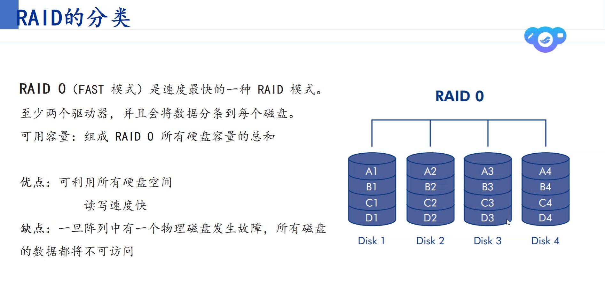

## RAID 1(安全)
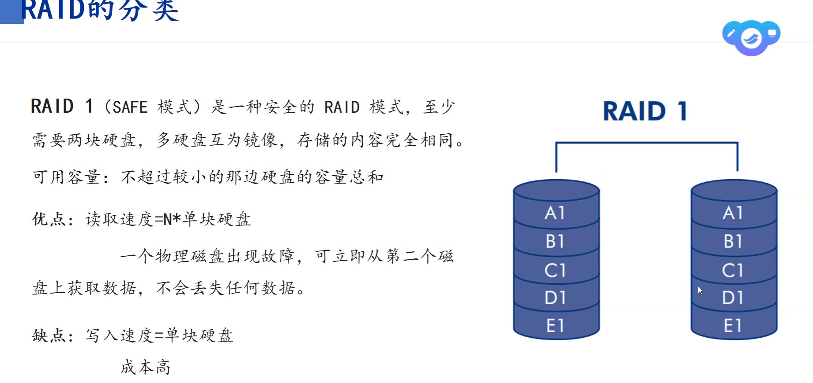

## RAID 3(1、2结合):奇偶校验盘、异或
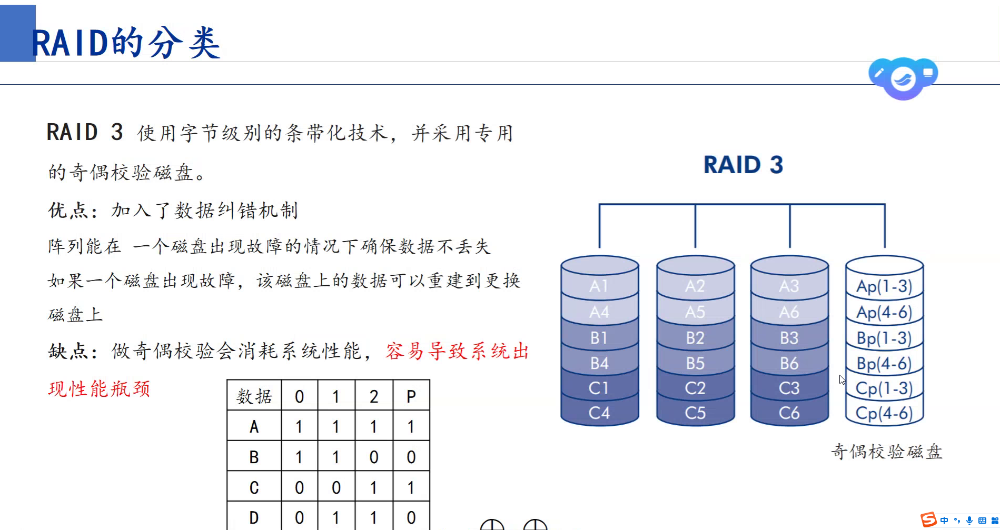

## 动态磁盘对应RAID
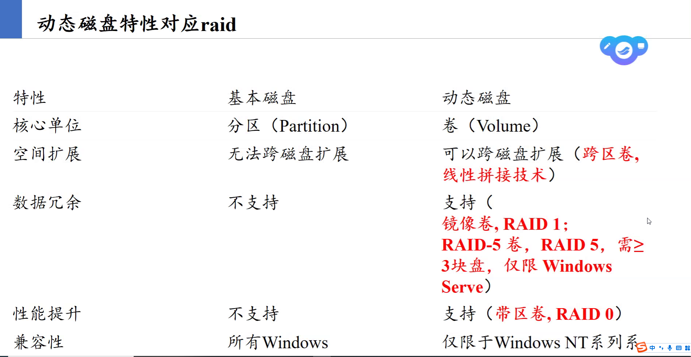

# 练习
## 1、管理磁盘的步骤:分区 -> 格式化 -> 挂载

## 2、单个文件大小不能超过4GB的文件系统:FAT32
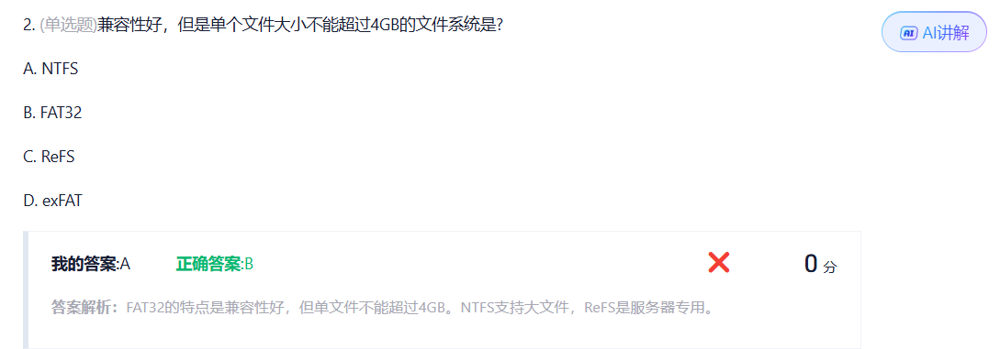

## 3、扩展分区内部的理论上可以无限创建且用于存储数据的逻辑单元:逻辑驱动器

## 4、将基本磁盘转换为动态磁盘对原有数据影响:无损转换,数据不会丢失

## 5、镜像卷中的一块物理硬盘故障损坏时,磁盘管理界面中改卷状态显示:冗余失败
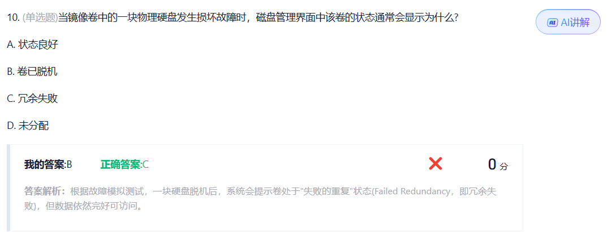

## 6、基本磁盘的局限性在于分区独立、大小固定无法跨磁盘扩展、不支持数据冗余

# 7、跨区卷合并空间,利用率100%但无冗余(坏一块全丢);镜像卷做数据备份,利用率50%,有冗余机制

# 8、破坏镜像卷后原镜像卷顶部的酒红色条带变为黄色(简单卷),系统为另一块盘分配新盘符,两盘数据完好且一致

