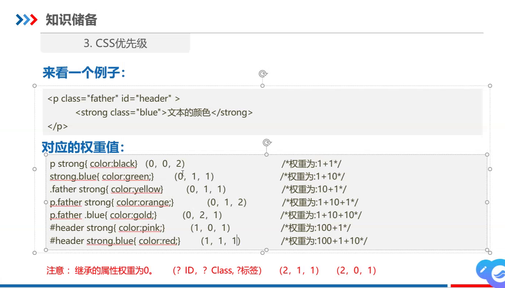

# 先写选择器，再写标签

# 选择器区分大小写

# 内嵌式:在<style>内写css代码
# 行内式:将css代码写在<body>下面的标签属性里(一般不推荐用)
# 外链式:用<link>标签,连接另一个.css文件(里面是<style>标签的代码)
# 导入式:基本不用

# 选择器
## 1、标签选择器：标签名{属性1:属性值1;···}
## 2、类选择器：.类值
### 一个标签可能同从于多个类,中间加空格
### 多个标签可以从属于一个类,class用空格隔开,里面没有.
## 3、id选择器：#id值
### 每个id值是唯一的
### id只能有一个
### id值第一个字符为字母,不能为数字

# 通配符:*

# css字体样式属性

# css文本外观属性

# css复合选择器
## 1、交集选择器
## 2、后代选择器
## 3、子代选择器
## 4、并集选择器

# css层叠性与继承性
## 继承的属性权重是最低的
## 权重值(id? class? 标签?)
