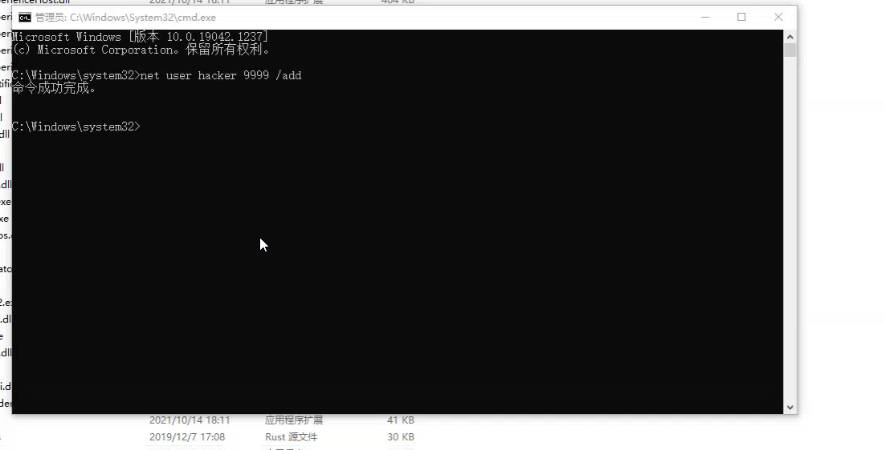
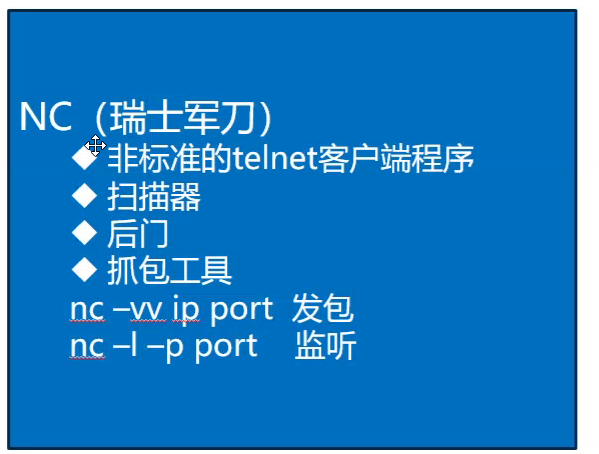
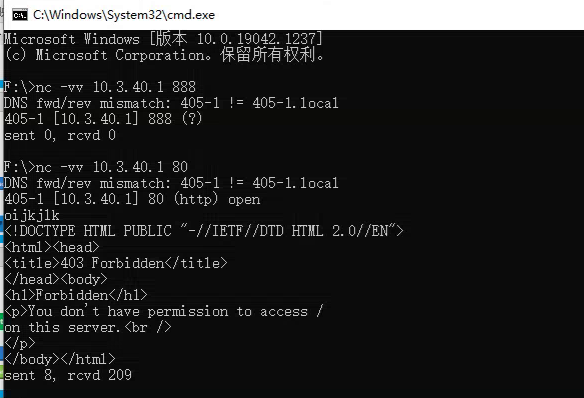

1、命令
# ping

# ping ip -t:不停地ping
# ping ip -l:数据包携带的字节部分
# 死亡之ping:ping ip -l (>65535)

# ipconfig、ifconfig

# ipconfig -all

# tracert 

# tracert url

# netstat

# netstat -na(n:常用的、a:所有的)

# arp(查看Mac地址与ip地址的绑定)

# arp -a

# net系列命令

# net use(连接目标主机,需要账户)
# net user
# net view(查看本地有哪些网络连接)
# net share(目录共享)
# net localgroup()
# net time(网络时间)
# net start(启动服务)

2、
# 计算机管理

3、
# nc -vv ip port(发包)
# nc -l -p port(监听)

